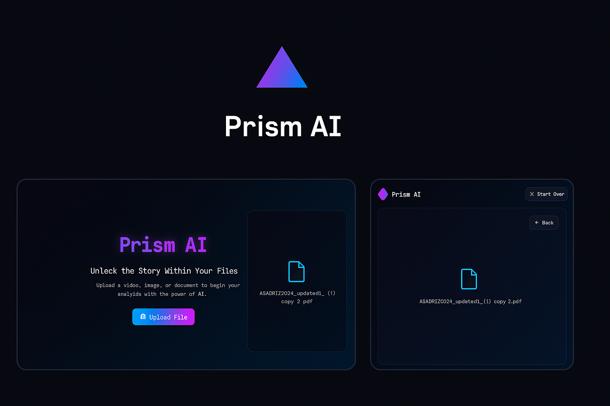

<div align="center">
  <h1 align="center">
    <a href="#">

    </a>
    PrismAI
  </h1>
  <h3 align="center">✨ The Future of AI-Enhanced Learning ✨</h3>
  
  <p align="center">
    <a href="#getting-started">
      
    </a>
    <a href="#features">
      
    </a>
    <a href="#demo">
      
    </a>
  </p>

  <div align="center">
    
  </div>

  <div style="display: flex; justify-content: center; gap: 15px; margin: 20px 0;">
    <a href="https://reactjs.org/" target="_blank">
      
    </a>
    <a href="https://www.typescriptlang.org/" target="_blank">
      
    </a>
    <a href="https://vitejs.dev/" target="_blank">
      
    </a>
    <a href="https://ai.google/" target="_blank">
      
    </a>
  </div>
</div>

<div align="center">
  <a href="#prismai">
    
  </a>
</div>

## Why PrismAI?

PrismAI revolutionizes the way you learn by combining cutting-edge AI with intuitive design. Whether you're a student, professional, or lifelong learner, our platform adapts to your unique learning style, making education more engaging, effective, and enjoyable than ever before.

## 🚀 Key Features

<div align="center">
  <table>
    <tr>
      <td width="33%" align="center">
        <h3>🎯 Smart Flashcards</h3>
        <p>AI-generated flashcards that adapt to your learning pace</p>
      </td>
      <td width="33%" align="center">
        <h3>📊 Interactive Learning</h3>
        <p>Engage with dynamic content and real-time feedback</p>
      </td>
      <td width="33%" align="center">
        <h3>🎥 Video Integration</h3>
        <p>Learn from videos with AI-powered insights</p>
      </td>
    </tr>
  </table>
</div>
- **Data Visualization** - Track your progress with beautiful charts
- **Responsive Design** - Study on any device, anywhere

## 🛠️ Tech Stack

<div align="center">
  <table>
    <tr>
      <td width="50%" align="center">
        <h3>Frontend</h3>
        <p>
          
          
        </p>
        <p>Built with React 18 and TypeScript for type safety and better developer experience</p>
      </td>
      <td width="50%" align="center">
        <h3>Build & Styling</h3>
        <p>
          
          
        </p>
        <p>Ultra-fast builds with Vite and modular styling with CSS Modules</p>
      </td>
    </tr>
    <tr>
      <td width="50%" align="center">
        <h3>AI & Data</h3>
        <p>
          
          
        </p>
        <p>Powered by Google's Generative AI and beautiful visualizations with D3.js</p>
      </td>
      <td width="50%" align="center">
        <h3>UI/UX</h3>
        <p>
          
          
        </p>
        <p>Beautiful, responsive design with Material Icons</p>
      </td>
    </tr>
  </table>
</div>

## 🚀 Quick Start

Get up and running with PrismAI in just a few simple steps:

<div align="left">
  <details>
    <summary><b>1️⃣ Clone the repository</b></summary>
    <br/>
    <div align="left">
      <pre><code>git clone https://github.com/Asadriz1/prism-ai.git
cd prism-ai</code></pre>
    </div>
  </details>

  <details>
    <summary><b>2️⃣ Install dependencies</b></summary>
    <br/>
    <div align="left">
      <pre><code>npm install</code></pre>
      <p>This will install all the necessary packages.</p>
    </div>
  </details>

  <details>
    <summary><b>3️⃣ Start the development server</b></summary>
    <br/>
    <div align="left">
      <pre><code>npm run dev</code></pre>
      <p>This will start the development server with hot-reload enabled.</p>
    </div>
  </details>

  <details>
    <summary><b>4️⃣ Open in your browser</b></summary>
    <br/>
    <div align="left">
      <p>Visit <a href="http://localhost:5173">http://localhost:5173</a> in your browser</p>
      <p>Or run this command to open it automatically:</p>
      <pre><code>open http://localhost:5173  # On macOS
start http://localhost:5173  # On Windows</code></pre>
    </div>
  </details>
</div>

### 🔧 Environment Variables

Create a `.env` file in the root directory and add your API keys:

```env
VITE_GOOGLE_AI_API_KEY=your_api_key_here
```

## 📸 Screenshots

*(Add your screenshots here)*

## 🤝 Contributing to PrismAI

We're thrilled you're interested in contributing to PrismAI! Whether you're a developer, designer, or just someone with great ideas, your help is invaluable.

### 🛠 How to Contribute

1. **Fork the Repository**
   - Click the 'Fork' button at the top right of the repository page
   - Clone your forked repository to your local machine

2. **Set Up Development Environment**
   ```bash
   git clone https://github.com/your-username/prism-ai.git
   cd prism-ai
   npm install
   ```

3. **Create a Feature Branch**
   ```bash
   git checkout -b feature/amazing-feature
   ```

4. **Make Your Changes**
   - Write clear, concise commit messages
   - Follow the existing code style
   - Add tests if applicable

5. **Commit and Push**
   ```bash
   git add .
   git commit -m "Add amazing feature"
   git push origin feature/amazing-feature
   ```

6. **Open a Pull Request**
   - Go to the original repository
   - Click "New Pull Request"
   - Describe your changes and submit

### 🎯 Good First Issues

New to open source? Check out our [good first issues](https://github.com/Asadriz1/prism-ai/issues?q=is%3Aopen+is%3Aissue+label%3A%22good+first+issue%22) to get started!

### 📝 Code of Conduct

Please read our [Code of Conduct](CODE_OF_CONDUCT.md) to understand the community standards and expectations.

## 🌟 Support PrismAI

Loving PrismAI? Here's how you can show your support:

<div align="center">
  <a href="https://github.com/Asadriz1/prism-ai/stargazers">
    
  </a>
  <a href="https://github.com/Asadriz1/prism-ai/fork">
    
  </a>
  <a href="https://github.com/Asadriz1/prism-ai/issues">
    
  </a>
</div>

## 📬 Get in Touch

Have questions or suggestions? We'd love to hear from you!

<div align="center">
  <a href="https://twitter.com/your_twitter" target="_blank">
    
  </a>
  <a href="mailto:your.email@example.com">
    
  </a>
  <a href="https://github.com/Asadriz1/prism-ai/discussions">
    
  </a>
</div>

## 🙏 Acknowledgments

- [Google AI](https://ai.google/) for their amazing AI technology
- [React](https://reactjs.org/) and [Vite](https://vitejs.dev/) teams
- All our wonderful contributors and users

---

<div align="center">
  <p>Made with ❤️, ☕, and the power of AI</p>
  <p>© 2023 PrismAI. All rights reserved.</p>
</div>

This contains everything you need to run your app locally.

## Run Locally

**Prerequisites:**  Node.js


1. Install dependencies:
   `npm install`
2. Set the `GEMINI_API_KEY` in [.env.local](.env.local) to your Gemini API key
3. Run the app:
   `npm run dev`
